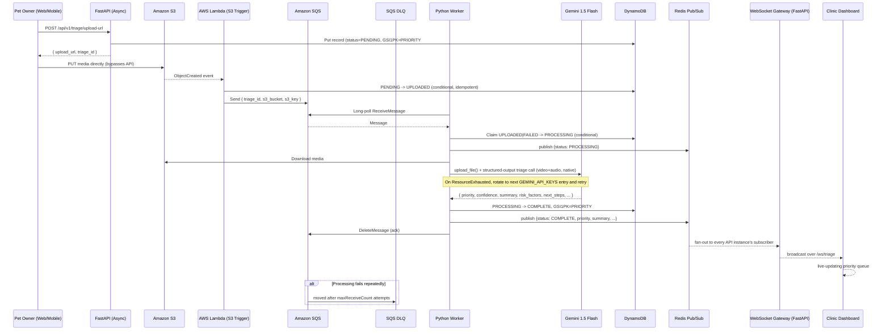

# AI Vet-Triage

An asynchronous, event-driven platform for veterinary clinics. A pet owner uploads a video/audio
clip plus a text description; the system transcribes and triages it with AI in the background,
assigns a priority (**RED / YELLOW / GREEN**), and pushes the result to a clinic dashboard in
real time over WebSockets.

Built as a portfolio project to demonstrate system design, AWS, and AI-integration engineering:
presigned uploads, event-driven fan-out (S3 → Lambda → SQS → worker), idempotent distributed
processing, DynamoDB single-table design, LLM structured outputs, and horizontally-scalable
real-time push via Redis Pub/Sub.

## Architecture



```
[Pet Owner Client]
      │ 1. POST /api/v1/triage/upload-url
      ▼
[FastAPI] ──writes PENDING record──▶ [DynamoDB]
      │ 2. returns presigned S3 PUT URL
      ▼
[Client uploads directly to S3]  ◀── bypasses the API server entirely
      ▼
[S3 Bucket] ──ObjectCreated event──▶ [Lambda] ──▶ DynamoDB: UPLOADED
                                          │
                                          ▼
                                     [SQS Queue] ──(after N retries)──▶ [DLQ]
                                          │
                                          ▼
                         [Python Worker — long-polls SQS, auto-scales on queue depth]
                              1. claim UPLOADED/FAILED -> PROCESSING (conditional)
                              2. download media from S3
                              3. Gemini 1.5 Flash: upload_file() + structured-output triage
                                 call in one shot (native video+audio, no separate
                                 transcription/frame-extraction step; rotates across
                                 GEMINI_API_KEYS on ResourceExhausted)
                              4. write COMPLETE + GSI1PK=PRIORITY#{RED|YELLOW|GREEN}
                              5. publish update to Redis
                                          │
                                          ▼
                              [Redis Pub/Sub] ──fans out to every API instance──▶
                                          │
                                          ▼
                        [FastAPI WebSocket Gateway] ── /ws/triage ──▶ [Clinic Dashboard]
```

### Repo layout

```
app/
├── main.py                # FastAPI app, lifespan (starts the Redis listener task)
├── core/config.py         # pydantic-settings — single source of truth for all config
├── db/
│   ├── schema.py           # single-table DynamoDB key design (see "Design Decisions" below)
│   └── dynamodb.py         # async boto3 wrapper (get/put/update via asyncio.to_thread)
├── models/triage.py        # TriageStatus, Priority, request/response + TriageResult schemas
├── routers/
│   ├── triage.py            # POST /api/v1/triage/upload-url
│   └── ws.py                 # GET /ws/triage
├── services/
│   ├── s3.py, sqs.py, media.py, pubsub.py
│   └── ai/                   # prompts.py, triage_llm.py, gemini_client.py (key rotation)
└── ws/
    ├── manager.py            # ConnectionManager — this process's WebSocket clients
    └── listener.py           # Redis -> ConnectionManager.broadcast background task
worker/main.py               # standalone AI worker process (SQS -> S3 -> AI -> DynamoDB -> Redis)
lambda/s3_upload_trigger/    # S3 ObjectCreated Lambda (dependency-free: stdlib + boto3 only)
scripts/                     # create_bucket/table/queue.py, deploy_s3_trigger.sh,
                              # local_s3_trigger_poller.py, simulate_triage_update.py
web/dashboard.html           # zero-dependency WebSocket test client (served via GET /dashboard)
tests/                       # pytest suite — moto (AWS) + fakeredis (Redis), no live creds needed
Dockerfile, docker-compose.yml  # one-command local spin-up (api + worker + Redis + LocalStack)
```

## Key design decisions & interview talking points

**Idempotency at every hop.** S3 delivers events at-least-once, SQS delivers at-least-once, and
workers can crash mid-job — so every state transition is a *conditional* DynamoDB update, not a
blind write:
- Lambda: `PENDING -> UPLOADED` only if status is still `PENDING`. A duplicate S3 notification is
  a safe no-op instead of double-enqueuing (`lambda/s3_upload_trigger/handler.py`).
- Worker: `UPLOADED|FAILED -> PROCESSING` only if the case isn't already claimed — guards against
  two workers grabbing the same message in a visibility-timeout race (`worker/main.py:_claim_for_processing`).
- Worker: if a redelivered message points at an already-`COMPLETE` case (e.g. the worker crashed
  between the DynamoDB write and the SQS ack), it acks and skips reprocessing — avoids re-billing
  the Gemini call on retry.

**DynamoDB single-table design with a GSI for the priority queue.**
```
PK = TRIAGE#{triage_id}     SK = METADATA
GSI1PK = PRIORITY#{priority}   GSI1SK = CREATED_AT#{iso_timestamp}
```
The dashboard's core access pattern — "all RED cases, newest first" — is one `Query` against
`GSI1` (`GSI1PK == "PRIORITY#RED"`, `ScanIndexForward=False`), not a table scan. New records start
at `GSI1PK = PRIORITY#PENDING` so they're visible in an "awaiting triage" view immediately, and
the worker flips it to the real priority on completion. `GSI1SK` is deliberately *never* touched
after creation — it holds the original submission time, so the queue stays ordered by "when the
case came in," not "when the AI happened to finish."

**SQS + DLQ for failure isolation.** `maxReceiveCount=3` (`scripts/create_queue.py`): a message
that fails processing 3 times moves automatically to the DLQ instead of looping forever or being
silently dropped. The worker never deletes a message on failure — it just marks the DynamoDB
record `FAILED` (visible on the dashboard) and lets SQS's own visibility timeout drive the retry.
Two independent recovery mechanisms working together: SQS handles retry *mechanics*, DynamoDB
status gives *real-time visibility* into what's currently broken.

**Redis Pub/Sub is structurally required, not a nice-to-have.** The worker and the API are
separate processes (separate hosts, in production). An in-memory broadcaster living inside one API
instance has no way to observe an event published by a different process — there is no
in-process fallback that actually closes that gap. Redis is the mechanism that lets *N*
horizontally-scaled API replicas all learn about an update from *one* worker: each replica runs
its own subscriber (`app/ws/listener.py`) feeding its own local `ConnectionManager`
(`app/ws/manager.py`), so a dashboard client stays correctly updated no matter which replica it's
connected to. When `REDIS_URL` is unset, publish/subscribe both degrade to a clean no-op — the
DynamoDB write still succeeds, the dashboard just won't get a live push.

For local demos specifically, `POST /ws/broadcast` (`app/routers/ws.py`) is a narrow, deliberate
exception: it broadcasts directly to whatever's connected to *this* process, over plain HTTP. That
doesn't contradict the point above — it's not an in-process fallback (the simulate script and the
API are still separate processes), it's a second, Redis-free way for one process to reach another
on the same machine, which is all a single local `python main.py` needs. It's unauthenticated and
single-replica-only by design, so it's not a substitute for Redis in any multi-instance deployment
— see `scripts/simulate_triage_update.py`.

**Multimodal AI handling: one native call, no manual media processing.** Gemini 1.5 Flash ingests
the raw uploaded file directly via `genai.upload_file()` and processes both the video frames and
the audio track in a single `generate_content()` call — no separate Whisper transcription step and
no `ffmpeg` frame extraction (both existed in an earlier OpenAI-based version of this pipeline and
were removed entirely, not just made optional). The call requests **Structured Output**
(`response_mime_type="application/json"`, `response_schema=...`) against a schema requiring
`priority`, `confidence`, `risk_factors`, `next_steps`, a `requires_human_review` flag, and a
`disclaimer` — deterministic, parseable output instead of prompt-and-pray free text. One real
schema-dialect gotcha worth knowing: Gemini's `response_schema` is a distinct (OpenAPI-subset)
dialect from OpenAI's JSON Schema — notably, it has no `const` keyword, so unlike an OpenAI-based
version it can't pin the disclaimer to an exact string at the schema level. `TriageResult` closes
that gap with a `field_validator` that enforces an exact match instead
(`app/models/triage.py:DISCLAIMER_TEXT`) — a wrong/missing disclaimer fails validation (and the
case) rather than silently passing through.

**Gemini API key rotation on quota exhaustion.** `GEMINI_API_KEYS` is a comma-separated pool, not
a single key. `google-generativeai` has no per-call or per-model API key parameter —
`genai.configure(api_key=...)` sets *global* module state — so "rotating" a key means re-calling
`configure()` with the next key before the next attempt, not swapping a client object
(`app/services/ai/gemini_client.py:GeminiKeyRotator`). `call_with_key_rotation()` wraps each Gemini
call: on `google.api_core.exceptions.ResourceExhausted` it logs a warning, rotates, and retries —
up to once per configured key. Critically, it does **not** rotate on other exception types (bad
request, network error, ...): a quota error on key #1 says nothing about key #2's validity, but a
malformed request isn't fixed by switching keys, so those propagate immediately instead of burning
through the whole key pool pointlessly. If every key is exhausted,
`AllGeminiKeysExhaustedError` propagates out of the worker's message handler and the SQS message is
left un-acked — normal SQS redelivery / DLQ handling (see above) takes over from there, exactly the
same failure path as any other unrecoverable processing error.

**Other things worth mentioning if asked:**
- Presigned S3 PUT URLs mean the API server never touches media bytes — it stays stateless and
  scales on request count alone; media bandwidth flows client → S3 directly.
- boto3 is synchronous; every AWS call in the FastAPI process is offloaded via `asyncio.to_thread`
  so a DynamoDB/S3/SQS round-trip never blocks the event loop (`app/db/dynamodb.py`).
- DynamoDB's boto3 resource rejects native Python `float` — `TriageResult.confidence` gets
  round-tripped through JSON with `parse_float=Decimal` before being written
  (`worker/main.py:_dynamo_safe_result`). A real bug the test suite caught, not a hypothetical.
- The Lambda is deliberately dependency-free (stdlib + boto3 only, no shared import from `app/`)
  so its deployment package stays tiny and its release cycle is decoupled from the API/worker.
- `google-generativeai` (the SDK this project uses, per explicit requirement) is fully deprecated —
  Google has ended support and recommends migrating to `google-genai`. Worth flagging as a known,
  accepted tradeoff rather than an oversight; see "Production notes" below.

## Quickstart

### 1. Automated tests (no AWS, Gemini, or Redis account needed)

```bash
python -m venv .venv && source .venv/bin/activate
pip install -r requirements-dev.txt
pytest tests/ -v
```

This exercises the real logic — not just imports — against **`moto`** (mocked S3/DynamoDB/SQS)
and **`fakeredis`** (mocked Redis pub/sub), with the Gemini SDK calls stubbed via `monkeypatch`:

| File | What it proves |
|---|---|
| `tests/test_worker.py` | Full pipeline (download → Gemini triage → DynamoDB → ack), idempotent redelivery-after-success, failure → `FAILED` + message left for retry |
| `tests/test_gemini_key_rotation.py` | `GeminiKeyRotator` wraparound; `call_with_key_rotation()` rotates on `ResourceExhausted` and retries, does *not* rotate on unrelated exceptions, raises `AllGeminiKeysExhaustedError` once every key is spent |
| `tests/test_gemini_triage.py` | `run_triage_assessment()` against a mocked `genai.upload_file`/`GenerativeModel`: parses a valid structured response, and rotates across multiple keys mid-call before succeeding |
| `tests/test_websocket.py` | `ConnectionManager` fan-out + dead-connection pruning, `/ws/triage` connect/disconnect lifecycle |
| `tests/test_pubsub.py` | Full chain: `publish_triage_update()` → Redis → `run_listener()` → `ConnectionManager.broadcast()` → client |

Table/queue provisioning scripts (`scripts/create_table.py`, `scripts/create_queue.py`) run for
real inside these tests via `moto` — the tests exercise the same schema-creation code path used
in actual dev/prod, not a separate test-only stub.

### 2. One-command local demo with Docker Compose (no AWS account needed)

```bash
docker compose up --build
```

This spins up the **entire pipeline** locally:

| Service | Role |
|---|---|
| `localstack` | Emulates S3 + DynamoDB + SQS |
| `init` | One-off job: provisions the bucket, table+GSI1, queue+DLQ against LocalStack, then exits |
| `redis` | Backs the WebSocket fan-out |
| `api` | FastAPI, `http://localhost:8000` |
| `worker` | The AI worker, long-polling SQS |
| `s3-trigger` | Local stand-in for the S3→Lambda trigger — polls S3 and invokes the *real* `lambda/s3_upload_trigger/handler.py` code unmodified (see the file's docstring for why LocalStack's own Lambda emulation was skipped) |

Set `GEMINI_API_KEYS` in your shell first if you want a real triage call:
```bash
export GEMINI_API_KEYS=key1,key2,key3
docker compose up --build
```
Without it, uploaded cases will fail at the AI step and route through `FAILED` → (after 3 attempts)
the DLQ — which is actually a convenient way to watch that exact failure-handling path fire for
real, without needing a key.

Then, same as the manual flow below: `open http://localhost:8000/dashboard` and `POST` to
`http://localhost:8000/api/v1/triage/upload-url`.

### 3. Full manual end-to-end run (real AWS + Gemini + Redis)

```bash
cp .env.example .env   # fill in AWS creds/region, S3 bucket, GEMINI_API_KEYS
```

**Provision AWS resources:**
```bash
python scripts/create_bucket.py         # media bucket (must match S3_BUCKET_NAME)
python scripts/create_table.py          # DynamoDB table + GSI1
python scripts/create_queue.py          # SQS processing queue + DLQ
./scripts/deploy_s3_trigger.sh          # deploys the Lambda + wires the S3 -> Lambda -> SQS path
```

**Start Redis** (for real-time dashboard push):
```bash
docker run -p 6379:6379 redis
# or: brew install redis && redis-server
```

**Run the API and the worker** (two separate processes, as in production):
```bash
python main.py            # FastAPI, http://localhost:8000/docs
python -m worker.main      # AI worker, long-polling SQS
```

**Open the live dashboard:**
```bash
open http://localhost:8000/dashboard
```
(Not `open web/dashboard.html` — see the note in section 4 below on why that opens the page via
`file://`, which silently breaks the WebSocket connection in some browsers.)

**Trigger a real case:**
```bash
curl -X POST http://localhost:8000/api/v1/triage/upload-url \
  -H "Content-Type: application/json" \
  -d '{"pet_owner_description": "Limping on the back leg since this morning", "species": "dog", "content_type": "video/mp4"}'
# -> { "triage_id": "...", "upload_url": "...", ... }

curl -X PUT "<upload_url from above>" \
  -H "Content-Type: video/mp4" \
  --data-binary @path/to/your/clip.mp4
```
Within a few seconds: S3 fires the event, Lambda flips the record to `UPLOADED` and enqueues it,
the worker picks it up, sends the media straight to Gemini for triage, writes the result, and the
dashboard updates live — no polling.

### 4. Zero-infrastructure WebSocket demo (no Docker, no Redis, no AWS, no Gemini)

The fastest way to see the live dashboard push working, with nothing running except the Python
app itself:

**Terminal 1 — start the API:**
```bash
python main.py
```

**Browser — open the dashboard:**
```bash
open http://localhost:8000/dashboard
```
Open it in a second tab too, to see the fan-out to multiple clients.

**Use `http://localhost:8000/dashboard`, not `open web/dashboard.html` directly.** Opening the raw
file loads it via `file://`, and browsers (Safari in particular) restrict outbound network
requests — including the WebSocket handshake — from `file://` pages. The dashboard just shows
"disconnected," and `POST /ws/broadcast` correctly reports `"recipients": 0` because the
connection never actually completed on the client side — there's no server-side error to point at,
since nothing went wrong on the server. `GET /dashboard` (`app/main.py`) exists specifically to
serve the same file same-origin with the WebSocket instead, which sidesteps the restriction
entirely rather than working around it. `web/dashboard.html` derives its `WS_URL` from
`location.host`, so this works regardless of which port you run the server on.

**Terminal 2 — fire a simulated event:**
```bash
python scripts/simulate_triage_update.py --priority RED
python scripts/simulate_triage_update.py --priority YELLOW --status PROCESSING
python scripts/simulate_triage_update.py --priority GREEN
```
Each call POSTs straight to `http://localhost:8000/ws/broadcast`, which broadcasts to every
WebSocket client connected to this process — both browser tabs update instantly.

This intentionally does **not** go through Redis (see the design-decision note above): a plain
HTTP call from one local process to another is simpler and needs zero setup, which is exactly what
a local demo needs. It's not how the real worker notifies the API in production — that's Redis
pub/sub, required once there's more than one API replica — but it exercises the same
`ConnectionManager`/`/ws/triage` code the real pipeline uses, so it's a faithful demo of the push
mechanism itself.

## Environment variables

See `.env.example` for the full, current list with defaults. Summary by concern:

| Variable | Purpose |
|---|---|
| `AWS_REGION`, `AWS_ENDPOINT_URL` | AWS region; set `AWS_ENDPOINT_URL` to target LocalStack in dev, leave blank for real AWS |
| `S3_BUCKET_NAME`, `PRESIGNED_URL_EXPIRY_SECONDS` | Media bucket and how long presigned upload URLs stay valid |
| `DYNAMODB_TABLE_NAME` | Single-table name (see key design above) |
| `SQS_QUEUE_NAME`, `SQS_DLQ_NAME`, `SQS_MAX_RECEIVE_COUNT`, `SQS_VISIBILITY_TIMEOUT_SECONDS` | Processing queue + DLQ config. Visibility timeout must exceed the worker's worst-case Gemini call latency, including any key-rotation retries |
| `GEMINI_API_KEYS`, `GEMINI_MODEL` | Comma-separated Gemini API key pool (rotated on quota exhaustion — see design decisions above) and the model name |
| `REDIS_URL`, `REDIS_TRIAGE_UPDATES_CHANNEL` | Real-time dashboard push. Leave `REDIS_URL` blank to disable gracefully (DynamoDB writes still succeed) |

All settings are centralized in `app/core/config.py` (`pydantic-settings`, `.env`-backed) — that
file is the source of truth if this table ever drifts.

Note: `AWS_ENDPOINT_URL` and `REDIS_URL` both treat a blank value (`KEY=` with nothing after it —
the conventional way to "leave a var unset" in a `.env` file) the same as omitting the line
entirely. Without that, pydantic-settings loads `KEY=` as a literal empty string rather than the
`None` default, and both boto3 and redis-py reject an empty endpoint URL outright instead of
treating it as "not configured" — a real bug this project hit during development, not a
hypothetical (see `app/core/config.py:_blank_env_value_means_unset`).

## Production notes

Infra provisioning here (`scripts/create_bucket.py`, `scripts/create_table.py`,
`scripts/create_queue.py`, `scripts/deploy_s3_trigger.sh`) is boto3/AWS-CLI, chosen deliberately so
the whole project is runnable with just an AWS account and no IaC toolchain. In a real production
stack, this would be Terraform/CDK/SAM instead — that tradeoff is called out explicitly in each
script's header comment.

Similarly, `docker-compose.yml` substitutes `scripts/local_s3_trigger_poller.py` (an S3 poller)
for a real Lambda deployment, because LocalStack's Lambda emulation is comparatively fragile to
wire into a one-command demo compared to its S3/DynamoDB/SQS emulation. The poller imports and
calls `lambda/s3_upload_trigger/handler.py` directly and unmodified, so this is a deployment-target
swap, not a reimplementation — the same code runs in Docker Compose and in real AWS Lambda.

**SDK note:** this project uses `google-generativeai`, which Google has fully deprecated (support
ended, no further updates) in favor of `google-genai`. That's a deliberate choice made to match an
explicit requirement, not an oversight — flagging it here so it isn't mistaken for one. The newer
SDK also has a materially different (and arguably better-suited) design for the key-rotation use
case: it's instance-based (`genai.Client(api_key=...)` per key) rather than
`genai.configure(api_key=...)` global module state, which would let `GeminiKeyRotator` hold N
ready client instances instead of re-configuring global state before every attempt. Worth a
follow-up migration.
